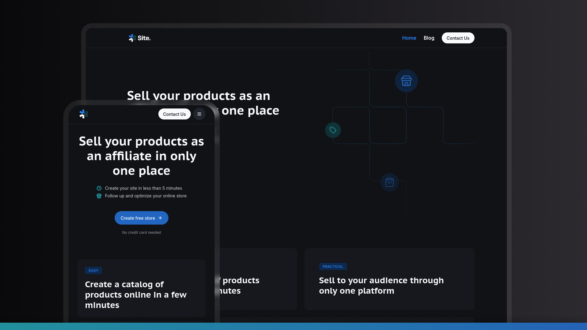

<p align="center">
  
</p>

<h1 align="center">Landing Page & Blog </h1>

<br/>



## 💻 About the project

This is a modern, responsive blog platform built with Next.js, designed to provide a seamless reading and content management experience. The project uses Contentlayer to manage Markdown-based blog posts and features a clean, minimalist design with Tailwind CSS.

## ✨ Features

- **Modern Stack:** Built with Next.js 15 (App Router) and React 19.
- **Static Site Generation:** Optimized for performance and SEO with statically generated pages.
- **Markdown-based Content:** Uses Contentlayer to manage blog posts written in Markdown.
- **Responsive Design:** Fully responsive layout for a great experience on any device.
- **Theming:** Light and dark mode support.
- **Developer Tools:** Includes ESLint, Prettier, and TypeScript for code quality and maintainability.

## 🚀 How to run the project

### Requirements

- [Node.js](https://nodejs.org/en/)
- [pnpm](https://pnpm.io/installation) (or your preferred package manager)

#### Running the web application

```bash
# Clone this repository
$ git clone <your-repo-url>

# Access the project folder in your terminal
$ cd site-blog

# Install all dependencies
$ pnpm install

# Run the application in development mode
$ pnpm dev

# The application will open at http://localhost:3000
```

## 🛠 Technologies

The following tools were used in this project:

### **Frontend** ([Next.js](https://nextjs.org/) + [TypeScript](https://www.typescriptlang.org/))

- **[React](https://reactjs.org/)**: A JavaScript library for building user interfaces.
- **[Next.js](https://nextjs.org/)**: The React framework for production.
- **[Contentlayer](https://www.contentlayer.dev/)**: Makes working with content easy, consistent, and safe.
- **[Tailwind CSS](https://tailwindcss.com/)**: A utility-first CSS framework for rapid UI development.
- **[Radix UI](https://www.radix-ui.com/)**: Unstyled, accessible components for building high-quality design systems.
- **[Lucide React](https://lucide.dev/)**: Beautiful & consistent icons.
- **[TypeScript](https://www.typescriptlang.org/)**: A typed superset of JavaScript that compiles to plain JavaScript.
- **[ESLint](https://eslint.org/)**: Pluggable and configurable linter tool for identifying and reporting on patterns in JavaScript.
- **[Prettier](https://prettier.io/)**: An opinionated code formatter.

> See the [package.json](./package.json) file for a full list of dependencies.

## 💪 How to contribute to this project

1.  **Fork** the project.
2.  Create a new branch with your changes: `git checkout -b my-feature`
3.  Save your changes and create a commit message telling you what you did: `git commit -m "feature: My new feature"`
4.  Submit your changes: `git push origin my-feature`

## 👨‍💻 Author

**Wilson Souza**

- Github: [@wilsonfsouza](https://github.com/wilsonfsouza)
- LinkedIn: [@wilsonfsouza](https://www.linkedin.com/in/wilsonfsouza/)

## 📝 License

This project is under the [MIT License](./LICENSE).

Made with ❤️ by Wilson Souza 👋
